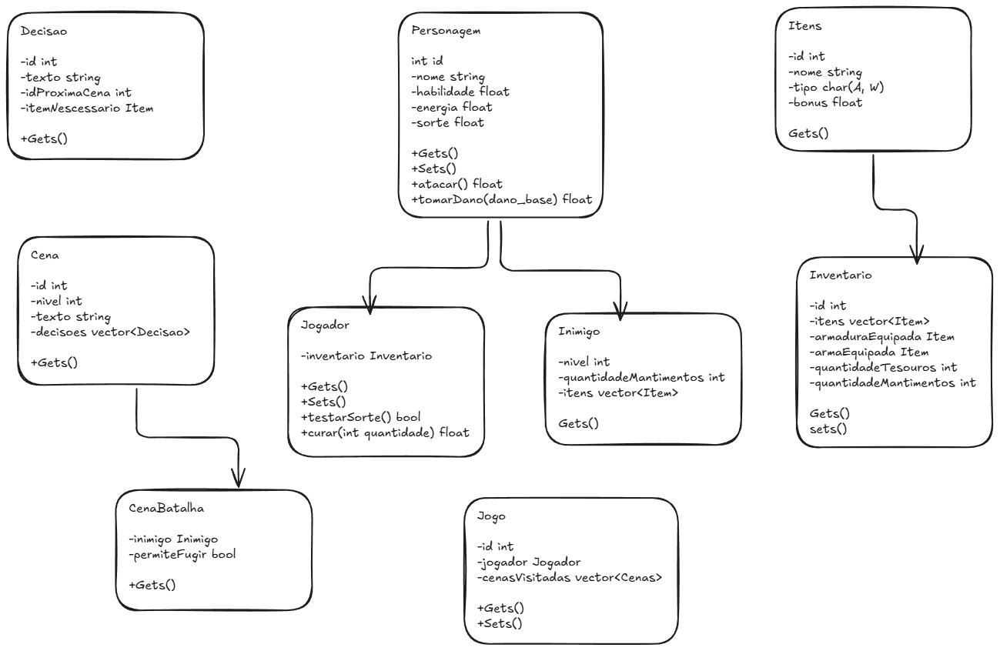

# POO Interactive RPG

Este projeto foi desenvolvido como parte da disciplina **Programação Orientada a Objetos (POO)**.  
O objetivo é criar um **jogo interativo de RPG em texto**, baseado na ideia de livros-jogo (_Fighting Fantasy_), utilizando conceitos avançados de **C++ e orientação a objetos**.

## 🎯 Objetivo

- Exercitar conceitos de **classes, herança, polimorfismo e encapsulamento**.
- Implementar um **sistema de personagens, inventário, combate e escolhas narrativas**.
- Utilizar arquivos de texto para definir **cenas, monstros e itens**, garantindo flexibilidade na criação da história.

## 🕹️ Funcionalidades

- Criação de personagem com atributos (Habilidade, Energia e Sorte).
- Inventário com itens, tesouros e provisões.
- Sistema de combate baseado em força de ataque e sorte.
- Narrativa interativa com múltiplas escolhas.
- Salvamento e carregamento de partidas.

## 📂 Estrutura (em contrução)

- `src/` → Código-fonte em C++.
- `scenes/` → Arquivos de texto contendo as cenas do jogo.
- `UML.png` → Diagrama de classes representando a estrutura do projeto.

## 🖼️ Diagrama UML



## ⚙️ Compilação e Execução

Para compilar o projeto (Linux/Mac):

```bash
g++ src/*.cpp -o jogo
./jogo
```

No Windows (MinGW):

```bash
g++ src/*.cpp -o jogo.exe
jogo.exe
```
